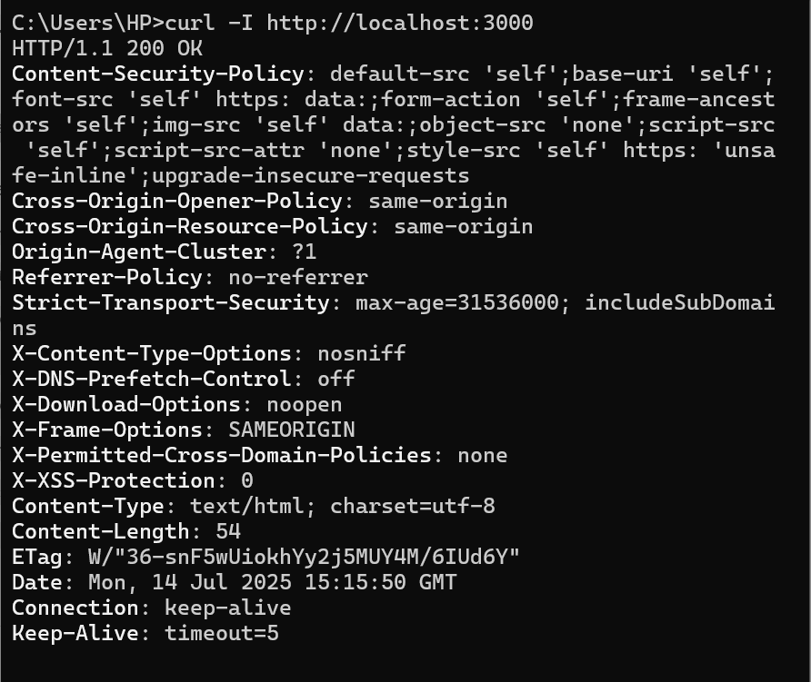
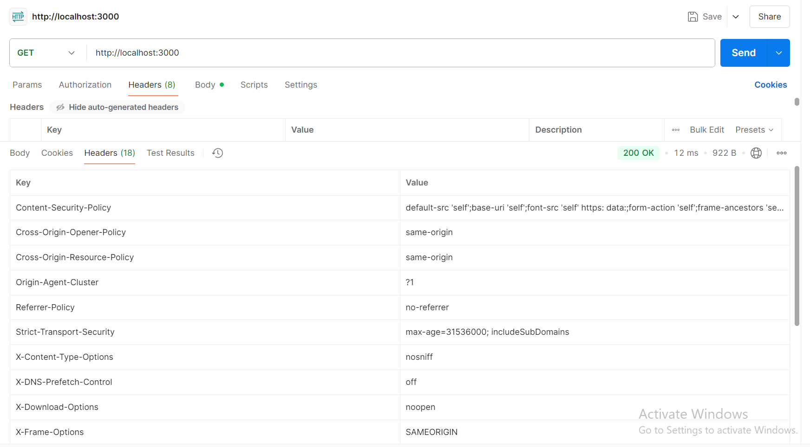
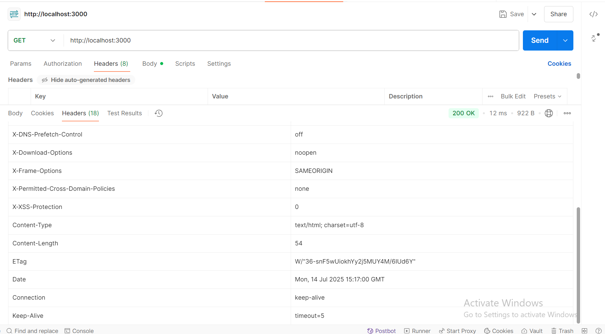
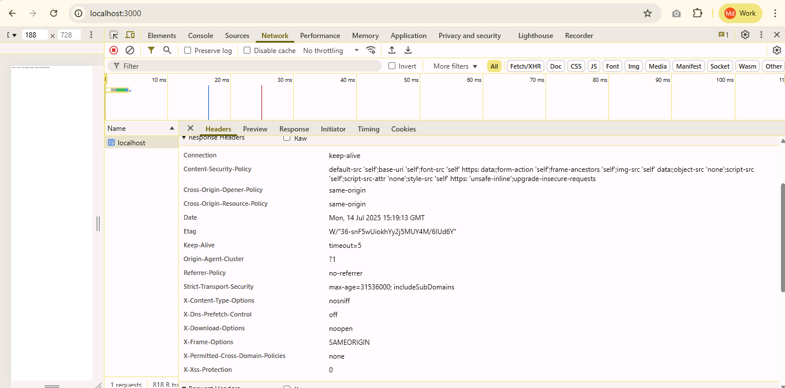

# How I Secured My Client’s Node.js App with Helmet.js (and How You Can Too!)

---

## Introduction

Recently, I had a new client project where my main responsibility was to **make their Node.js/Express app more secure**—without slowing down development or adding tons of code. In this post, I’ll share my learnings from **implementing [Helmet.js](https://helmetjs.github.io/)**, a tiny but powerful middleware that instantly adds multiple security layers to your Express application. If you want to understand how to make your website safer with minimal code, read on!

---

## Example Project

The first thing I did was set up a basic Express server, then add Helmet. You can check out a live, minimal project here:

**GitHub Example Repo:**  
[https://github.com/enayetsyl/mobile-app-experiment/tree/main/halmet](https://github.com/yourusername/express-helmet-starter)  


**Here’s the entire code:**

```js
const express = require('express');
const helmet = require('helmet');

const app = express();

// 1️⃣ Add Helmet middleware to your app
app.use(helmet());

/* 
  Helmet will now automatically add several important HTTP security headers 
  to all responses.
*/

app.get('/', (req, res) => {
  res.send('Hello, world! This Express app is protected by Helmet.');
  // 2️⃣ This route will now send Helmet’s headers along with the response.
});

const PORT = 3000;
app.listen(PORT, () => {
  console.log(`Server running at http://localhost:${PORT}`);
  // 3️⃣ The app is now listening and ready to accept requests.
});

```
### **Code Explanation:**

- `const express = require('express');`  
  *Loads Express, the popular Node.js web framework.*

- `const helmet = require('helmet');`  
  *Imports Helmet.js middleware.*

- `app.use(helmet());`  
  *Adds Helmet to all requests. This is the key security step!*

- The `/` route responds with a message, but the real magic is in the headers Helmet adds.

- The app starts on port 3000.

---

## Default Helmet Protections (Explained Simply)

When you add `app.use(helmet())`, you instantly get all these protections, **by default**:


1. **X-DNS-Prefetch-Control**
**What it does:** Controls if browsers should "look up" the addresses of links on your page before users click them.

**Why it matters:** Prevents browsers from prefetching DNS records that might leak information about which other sites your app links to.

**Default:** Helmet turns it off for privacy.

2. Frameguard (`X-Frame-Options`)
**What it does:** Stops your website from being loaded inside an `<iframe>` on another site.

**Why it matters:** Protects you from clickjacking attacks, where a bad site tries to trick users into clicking hidden buttons on your site by putting it inside a frame.

3. Hide Powered-By (`X-Powered-By`)
**What it does:** Removes the `X-Powered-By: Express` header.

**Why it matters:** Makes it harder for attackers to know you’re using Express, which means they have less information to plan an attack against known vulnerabilities.

4. HSTS (`Strict-Transport-Security`)
**What it does:** Tells browsers to always use HTTPS (secure connection) for your site in the future, not HTTP.

**Why it matters:** Protects users from being tricked into using an insecure version of your site, which can expose their info to hackers.

**Note:** Only works if your app is actually running with HTTPS.

5. X-Content-Type-Options
**What it does:** Adds `X-Content-Type-Options: nosniff` header.

**Why it matters:** Stops browsers from trying to "guess" what type of file is being served. This blocks certain attacks where hackers try to make the browser run malicious files as scripts.

6. Origin-Agent-Cluster
**What it does:** Tells modern browsers to keep your site’s code and data separate from other sites (“agent clusters”).

**Why it matters:** Prevents some newer types of attacks that try to access memory or data from other sites via shared browser processes.

7. Referrer-Policy
**What it does:** Sets the `Referrer-Policy` header to `no-referrer`.

**Why it matters:** When users click links, browsers usually tell the new site where the user came from (the "referrer"). This header stops that, protecting users’ privacy and your site’s information.

8. X-Permitted-Cross-Domain-Policies
**What it does:** Sets X`-Permitted-Cross-Domain-Policies: none`.

**Why it matters:** Prevents certain old Adobe products (like Flash or PDF readers) from pulling in data from your site. This closes off some rare but serious attacks.


## How to Test If Helmet is Working

You’ll want to confirm that Helmet is setting the right headers. Here are **three simple ways to check**:

### **A. With cURL (Command Line)**
Run this in your terminal:
```bash
curl -I http://localhost:3000
```
*You should see headers like 
- `X-Frame-Options: SAMEORIGIN` 
- `X-Content-Type-Options: nosniff`
- `X-DNS-Prefetch-Control: off` 
- `Referrer-Policy: no-referrer`
- `X-Permitted-Cross-Domain-Policies: none`
- `Origin-Agent-Cluster: ?1`
- `Strict-Transport-Security: ...` (only if using HTTPS)
- Notice that `X-Powered-By` is missing (it is normally Express).
If so, Helmet is working!*



---

### **B. With Postman**
1. Open Postman and create a GET request to `http://localhost:3000`.
2. Click “Send”.
3. Look at the “Headers” section in the response.


*In the “Headers” tab, you’ll see the Helmet-provided security headers.*


*Notice how `X-Frame-Options`, `X-Content-Type-Options`, and others are present.*

---

### **C. With Your Browser’s Developer Tools**
1. Open Chrome/Edge/Firefox and go to `http://localhost:3000`.
2. Right-click → **Inspect** → **Network** tab.
3. Reload the page, click on the `/` request, and check the **Response Headers**.


*You’ll see all the extra headers Helmet sets—if so, you’re protected!*

---

## Conclusion

Adding **Helmet.js** to your Node.js app is one of the **fastest, lowest-effort ways to boost your website’s security**.  
- It takes only **one line of code** to lock down common vulnerabilities.
- It’s well-maintained and widely used in the Node.js community.
- You can always add extra protections (like Content Security Policy) as your app grows.

**Next time you build or refactor an Express app, add Helmet right away—your users (and your client) will thank you!**

---

*Happy coding & stay secure!*


